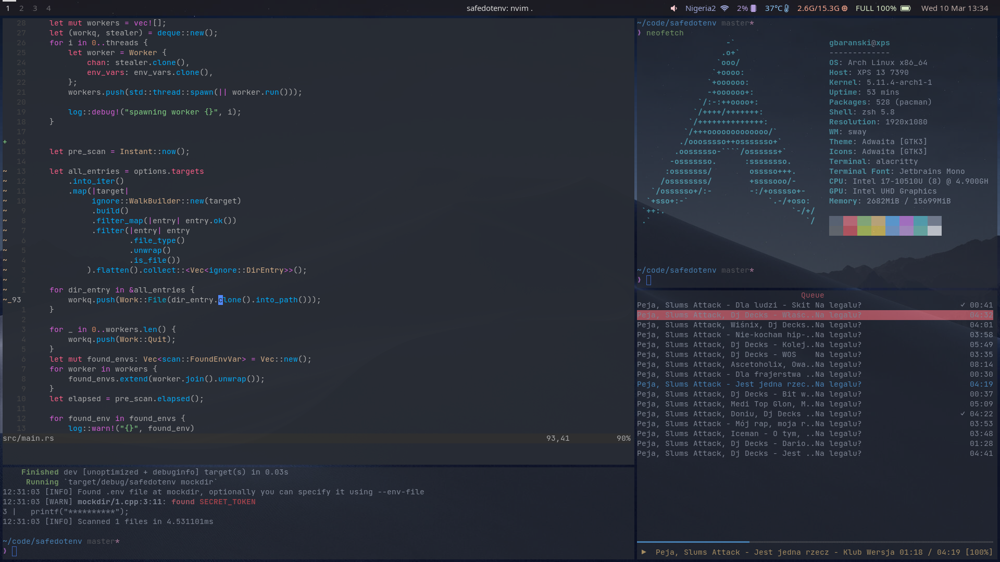

# .dotfiles

Chezmoi should be used with those dotfiles, it is required to add some data in chezmoi config using:
```
chezmoi edit-config
```
Add this
```toml
[data]
  email = "root@gbaranski.com" # Your email address
  name = "gbaranski"           # Your name for Git
  wayland = true               # True if using Wayland, enables Firefox/Chromium native wayland support
```

- [Window manager](#window-manager)
  * [Sway](#sway)
      - [Wofi](#wofi)
  * [i3](#i3)
  * [Tmux](#tmux)
- [Editor](#editor)
  * [Neovim](#neovim)
  * [Vim](#vim)
- [Shell](#shell)
  * [ZSH](#zsh)
- [Terminal emulator](#terminal-emulator)
  * [Alacritty](#alacritty)
- [Misc](#misc)

# Window manager

## Sway

Wallpaper **must** be present at ~/images/wallpaper.jpg

```zsh
# Dependencies

pamixer      # Changing volume
light        # Changing backlight brightness
wofi         # App launcher
alacritty    # Terminal emulator
waybar       # Top bar
python3-ipc  # Python IPC library for Sway/i3
playerctl    # Switching songs
wob          # Nice popup when switching volume/backlight 

## Verify deps with /usr/share/sway/scripts/grimshot check 
grim
slurp
swaymsg
wl-copy
jq
notify-send
```



#### Wofi

App launcher for [Sway](#sway)


## i3

Used as fallback when [Sway](#sway) is not able to do something

```
# Dependencies

feh     # Background
scrot   # Screenshots
picom   # Compositor 
polybar # Bar
pactl   # Changing volume
```

## Tmux

Terminal multiplexer, I use it when no tilling window manager available, or when SSHing to server

```
# Dependencies

tpm # Install with `git clone https://github.com/tmux-plugins/tpm ~/.tmux/plugins/tpm`
```


# Editor

## Neovim

Editor, using 0.5.0 prerelease because of official LSP Support

```zsh
# Dependencies

neovim  # must be >= 0.5.0 `paru -S neovim-git`
fzf     # fuzzy finder
ripgrep # better dir search 
```


## Vim

Used as fallback when Neovim 0.5.0 not available


# Shell

## ZSH

Shell, Bash alternative with great auto completion

```zsh
# Dependencies

lsd   # ls alternative
zinit # package manager(should be installed automatically)
```


# Terminal emulator

## Alacritty

Simple terminal emulator


# Misc

Provide `git sla` alias for nice git commit history


